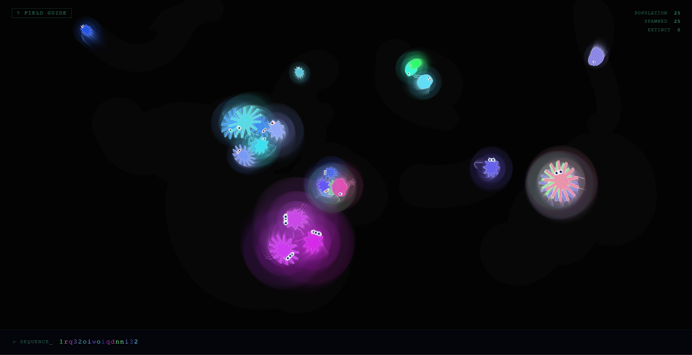
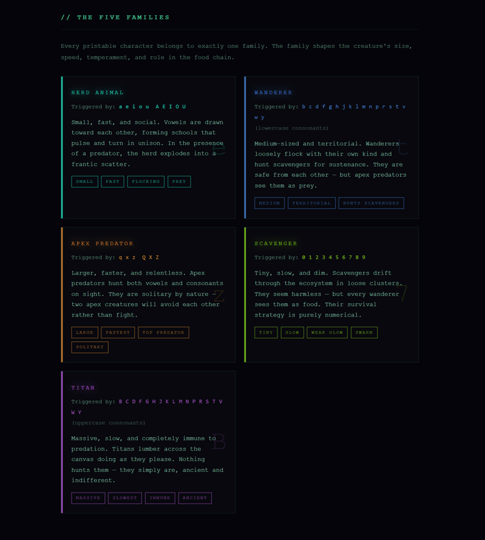
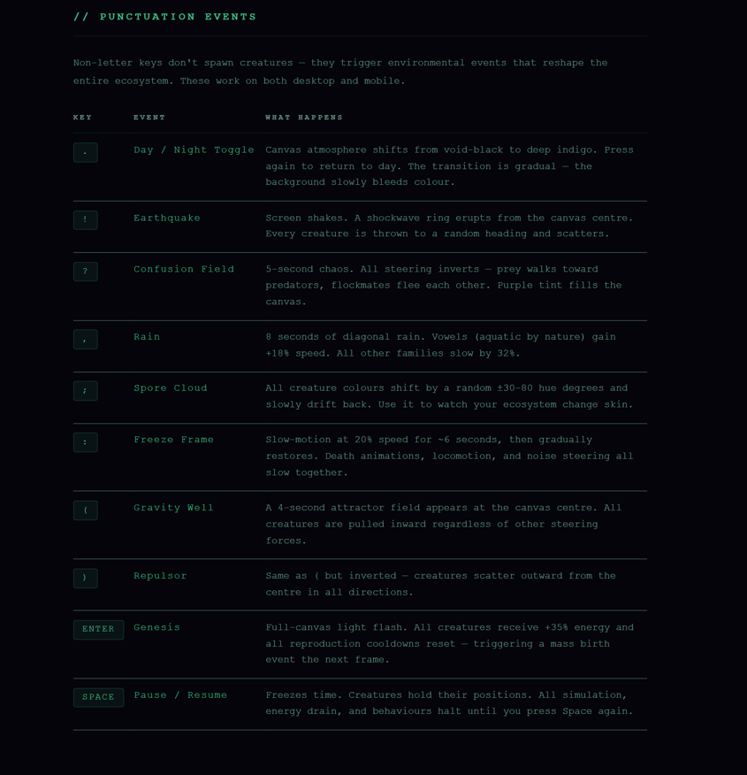
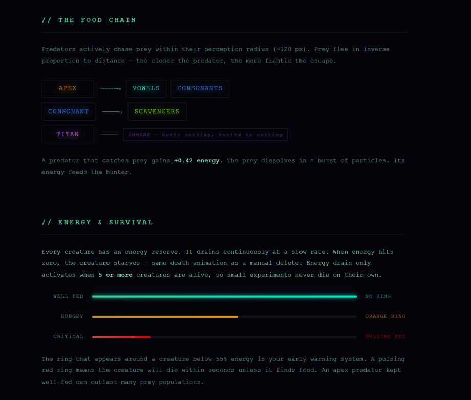

# Typographic Creature Lab

> **Every keystroke spawns a life form.** Type any character — it becomes a living organism with its own DNA, body, and behaviour. Build an ecosystem with your keyboard.

**[▶ Live Demo](https://creature-lab.vercel.app/)** · **[📖 Field Guide](https://creature-lab.vercel.app/guide.html)**



---

## What Is This?

Typographic Creature Lab is a browser-based ecosystem simulator where every printable character you type becomes a procedurally generated organism. Each creature has unique genetics derived from its character — determining its family, size, speed, appearance, and role in the food chain.

Type a sentence and watch a self-sustaining ecosystem emerge. Predators hunt prey. Herds flock together. Same-species pairs reproduce. Punctuation keys trigger dramatic environmental events — earthquakes, rain, gravity wells, slow-motion, and more.

It's part art installation, part simulation, part keyboard playground.

---

## The Five Families

Every character belongs to one of five families:

| Family | Characters | Role |
|--------|-----------|------|
| **Herd Animal** | `a e i o u` (any case) | Small, fast, social — prey |
| **Apex Predator** | `q x z Q X Z` | Large, fastest — hunts vowels & wanderers |
| **Wanderer** | `b c d f g h j k l m …` (lowercase consonants) | Medium, territorial — hunts scavengers |
| **Scavenger** | `0 1 2 3 4 5 6 7 8 9` | Tiny, slow — hunted by wanderers |
| **Titan** | `B C D F G H J K L M …` (uppercase consonants) | Massive, immune to predation — solitary |



---

## Punctuation Events

Non-letter keys don't spawn creatures — they trigger world events:

| Key | Event | Effect |
|-----|-------|--------|
| `.` | Day / Night | Canvas shifts to deep indigo |
| `!` | Earthquake | Screen shake, all creatures scatter |
| `?` | Confusion | 5s of inverted steering chaos |
| `,` | Rain | Vowels speed up, others slow down |
| `;` | Spore Cloud | All creature colours mutate |
| `:` | Slow Motion | 20% speed for ~6 seconds |
| `(` | Gravity Well | Pulls all creatures inward |
| `)` | Repulsor | Scatters all creatures outward |
| `Enter` | Genesis | Mass energy boost + birth burst |
| `Space` | Pause / Resume | Freezes time |



---

## Food Chain & Energy

```
Apex Predator  ──→  hunts  ──→  Herd Animal + Wanderer
Wanderer       ──→  hunts  ──→  Scavenger
Titan          ──→  immune  (hunts nothing, hunted by nothing)
```

Every creature drains energy over time. Predators gain energy by catching prey. When energy hits zero, the creature starves. Keep your ecosystem fed by typing more creatures, or trigger **Genesis** (`Enter`) for a mass energy boost.



---

## Reproduction

When two creatures of the **same family** stay close together and both have high energy, they reproduce. The offspring inherits blended DNA from both parents with ±12% mutation — creating unique variations in colour, size, speed, and body shape.

Leave a healthy ecosystem running and it will self-sustain through reproduction and predation.

---

## Getting Started

### Prerequisites

- [Node.js](https://nodejs.org/) (v18 or later)
- npm (comes with Node.js)

### Installation

```bash
# Clone the repository
git clone https://github.com/YOUR_USERNAME/creature-lab.git
cd creature-lab

# Install dependencies
npm install

# Start the development server
npm run dev
```

Open `http://localhost:5173` in your browser and start typing.

### Build for Production

```bash
npm run build
```

The built output goes to `dist/` — deployable anywhere that serves static files.

---

## Tech Stack

| Layer | Technology |
|-------|-----------|
| Language | TypeScript |
| Rendering | p5.js |
| Build tool | Vite |
| Architecture | Spatial hash grid + weighted sum steering behaviours |

The simulation uses a **spatial partitioning grid** for O(1) neighbour lookups and a **weighted sum steering system** for emergent behaviours (flocking, hunting, fleeing, separation).

---

## Project Structure

```
creature-lab/
├── src/
│   ├── main.ts          ← p5 sketch, input handling, game loop
│   ├── creature.ts      ← Creature class (update, draw, kill)
│   ├── dna.ts           ← DNA system, families, buildDNA, makeOffspringDNA
│   ├── behaviors.ts     ← Ecosystem behaviour engine (steering, energy, reproduction)
│   ├── grid.ts          ← Spatial hash grid for neighbour lookups
│   ├── env.ts           ← Environment state + event effects (shake, rain, slow-mo…)
│   ├── events.ts        ← Punctuation event dispatcher
│   ├── particles.ts     ← Death/birth particle system
│   ├── trails.ts        ← Creature motion trails
│   ├── ui.ts            ← HUD, tooltip, sequence terminal
│   ├── context.ts       ← Shared noise + canvas size bindings
│   ├── rng.ts           ← Seeded XORshift PRNG
│   └── style.css        ← All styles
├── public/
│   ├── cil--animal.svg  ← Favicon
│   └── *.png / *.mp4    ← Demo assets
├── guide.html           ← Field Guide (documentation)
├── index.html           ← Entry point
├── package.json
├── vite.config.ts
└── tsconfig.json
```

---

## Gallery

### Home Screen


### The Five Families


### Food Chain & Energy


### Punctuation Events


### Gameplay


---

## Videos

- **[Full Gameplay Video](public/creature-lab-full-video.mp4)** — see the ecosystem in action
- **[Field Guide Walkthrough](public/creature-lab-field-guide.mp4)** — overview of the documentation

---

## License

[MIT License](LICENSE) — do whatever you want with this.

---

## Credits

Built with [p5.js](https://p5js.org/) and [Vite](https://vitejs.dev/).

Favicon: [cil--animal.svg](https://iconduck.com/icons/285225/cil--animal) from CoreUI Icons.
